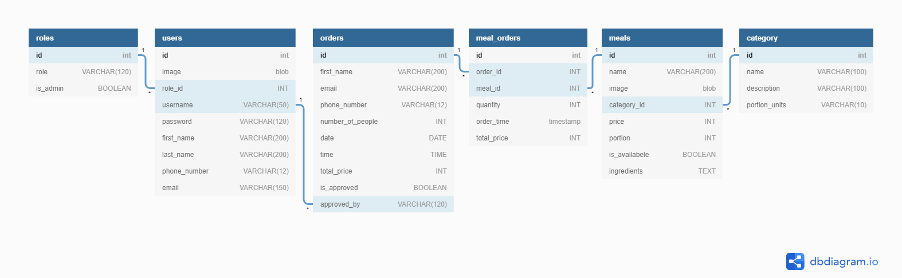

>**Initially there were more than 94 commits. 
>**They have been accidentally restored because of attemts to rebase master branch to newer one. 
>**Also we knew that it's risky so did some screenshoots
>**<a href="./commits.png">Screenshoot 1</a>
>**<a href="./commits1.png">Screenshoot 2</a>
>**Also it's recommended to test this project on localhost. Try instructions given below.

<p align="center"><a href="https://www.tandir-res.uz"></a></p>
<p align="center">
	<a href="https://travis-ci.org/laravel/framework"></a>
	<a href="https://packagist.org/packages/laravel/framework"></a>
	<a href="https://packagist.org/packages/laravel/framework"></a>
	<a href="https://packagist.org/packages/laravel/framework"></a>
</p>

## About <a href="http://tandir-res.uz/"><b>Tandir-res.uz</b></a>

Tandir is a software solution for cafe and restourant businesses made in Laravel framework and made with &#9829; by <sup>1</sup>Techieland&#8482;
- Simple
- Powerful
- User-friendly
- Open source

PS: **Tandir** brand name has created by Techieland for this assignment only \(we haven't checked weather this brand name is available out there or not\) and we have craeted simple logo for this.

## <sup>1</sup> Techieland

**Techieland** is our teamname who creates software solutions for businesses.

We tried to treat this assignment process as real as possible.

## How to clone and work on your local machine or use it on your host?

- Pre-requirements:
1. Install <a href="https://www.apachefriends.org/ru/index.html">XAMPP</a>
2. Install <a href="https://getcomposer.org/">Composer</a>
3. Install <a href="https://git-scm.com/">GIT</a>

- Steps to run the software on your local machine:
1. Clone this repository to "xampp/htdocs" directory.
2. Open PowerShell and run commands below step by step. 
3. 
```bash
  php -r "file_exists('.env') || copy('.env.example', '.env');"
```
4. 
```bash
  composer install -q --no-ansi --no-interaction --no-scripts --no-suggest --no-progress --prefer-dist
```
5. 
```bash
  php artisan key:generate
```
6. Run MySQL server via XAMPP
7. Create Data Base and name it "laravel"
8. Change properties in .env file as follows<br>
```
DB_CONNECTION=mysql
DB_HOST=127.0.0.1 (or alternative host)
DB_PORT=3306
DB_DATABASE=laravel
DB_USERNAME=root (by default, but if you have another username write it)
DB_PASSWORD= (by default empty, if you have password write it there)
```
7. On PowerShell run 
```bash
php artisan migrate
```
8. Run Apache and MySQL Servers and enjoy!


>**We are planning to do a Docker image for that app, so in the near future new version will be available on DockerHub also. 
>**After release you will need to just pull the image and run container.
- <a href="https://www.docker.com/">Learn more about Docker there!</a>

## How to use it as a Client

- It's really easy! 
- Reserve a table and pre-order dishes righ away from site!
- You can do it in 3 steps!

1. Open Home page, click red "Order Now" button
2. Fill the form for reservation and go down.
3. If you want, you can pre-order dishes for a reserved day or just click "Comlete" button and complete reservation process!

## How to use it as an Administrator

1. Open <a href="http://tandir-res.uz/admin/"><b>tandir-res.uz/admin</b></a>
2. Log-in.
3. View and analyse all tables about your business.
4. Create/edit/delete some features from your products list.
5. Create/edit/delete users and admins.
6. Approve the order and send email service.

## Migrations

<p align="center"></p>

<h3>Tools used</h3>
<ol>
	<li><a href="https://dbdiagram.io/">dbdiagram.io - web-site for drawing EER Diagrams</a></li>
	<li><a href="https://phpMyAdmin.net">phpMyAdmin</a></li>
	<li><a href="dev.mysql.com">MariaDB | MySQL</a></li>
	<li><a href="https://Mockgaroo.com/">Mockgaroo - generator of dump information</a></li>
</ol>


<h3>Tables</h3>

<table>
<caption>Roles</caption>
    <tbody>
        <tr>
            <td><b>id</b></td>
        </tr>
        <tr>
            <td>role</td>
        </tr>
        <tr>
            <td>is_admin</td>
        </tr>
    </tbody>
</table>

<table>
    <caption>users</caption>
    <tbody>
        <tr>
            <td><b>id</b></td>
        </tr>
        <tr>
            <td>image</td>
        </tr>
        <tr>
            <td>role_<b>id</b></td>
        </tr>
        <tr>
            <td>username</td>
        </tr>
        <tr>
            <td>password</td>
        </tr>
        <tr>
            <td>first_name</td>
        </tr>
        <tr>
            <td>last_name</td>
        </tr>
        <tr>
            <td>phone_number</td>
        </tr>
        <tr>
            <td>email</td>
        </tr>
    </tbody>
</table>

<table>
    <caption>category</caption>
    <tbody>
        <tr>
            <td><b>id</b></td>
        </tr>
        <tr>
            <td>name</td>
        </tr>
        <tr>
            <td>description</td>
        </tr>
        <tr>
            <td>portion_units</td>
        </tr>
    </tbody>
</table>

<table>
    <caption>meals</caption>
    <tbody>
        <tr>
            <td><b>id</b></td>
        </tr>        
        <tr>
            <td>name</td>
        </tr>
        <tr>
            <td>image</td>
        </tr>
        <tr>
            <td>category_<b>id</b></td>
        </tr>
        <tr>
            <td>price</td>
        </tr>
        <tr>
            <td>portion</td>
        </tr>
        <tr>
            <td>is_available</td>
        </tr>
        <tr>
            <td>ingredients</td>
        </tr>
    </tbody>
</table>

<table>
    <caption>orders</caption>
    <tbody>
        <tr>
            <td><b>id</b></td>
        </tr>
            <td>first_name</td>
        </tr>
        <tr>
            <td>email</td>
        </tr>
        <tr>
            <td>phone_number</td>
        </tr>
        <tr>
            <td>number_of_people</td>
        </tr>
        <tr>
            <td>date</td>
        </tr>
        <tr>
            <td>time</td>
        </tr>
        <tr>
        <tr>
            <td>total_price</td>
        </tr>
            <td>is_approved</td>
        </tr>
        <tr>
            <td>approved_by</td>
        </tr>
    </tbody>
</table>

<table>
    <caption>meal_orders</caption>
    <tbody>
        <tr>
            <td><b>id</b></td>
        </tr>
        <tr>
            <td>order_<b>id</b></td>
        </tr>
        <tr>
            <td>meal_<b>id</b></td>
        </tr>
        <tr>
            <td>quantity</td>
        </tr>
        <tr>
            <td>order_time</td>
        </tr>
        <tr>
            <td>total_price</td>
        </tr>
    </tbody>
</table>
